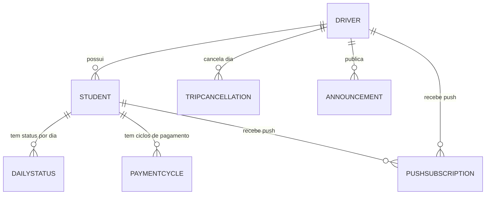

# Modelo de Dados

Modelagem relacional (PostgreSQL via Prisma). Todas as entidades vinculadas a um motorista carregam `driverId`, preparando o sistema para múltiplos motoristas no futuro sem reestruturação.

## Entidades

### Driver (Motorista)
| Campo | Tipo | Observação |
|---|---|---|
| id | uuid | PK |
| name | string | |
| email | string | único, usado para login |
| passwordHash | string | |
| pixKey | string | exibida aos alunos para pagamento manual |
| createdAt | datetime | |

### Student (Aluno)
| Campo | Tipo | Observação |
|---|---|---|
| id | uuid | PK |
| driverId | uuid | FK → Driver |
| name | string | |
| email | string | único, usado para login |
| passwordHash | string | |
| active | boolean | permite "desligar" aluno sem apagar histórico |
| createdAt | datetime | |

### DailyStatus (Status diário do aluno)
| Campo | Tipo | Observação |
|---|---|---|
| id | uuid | PK |
| studentId | uuid | FK → Student |
| date | date | dia de referência |
| status | enum | `vai_normal` \| `so_ida` \| `so_volta` \| `nao_vai` |
| boardedAt | datetime? | preenchido no check-in de embarque (RF04); nulo = ainda não embarcou |
| updatedAt | datetime | |

> Um registro por aluno por dia. Se não existir registro para o dia, assume-se `vai_normal` (RF01).

### TripCancellation (Cancelamento do dia)
| Campo | Tipo | Observação |
|---|---|---|
| id | uuid | PK |
| driverId | uuid | FK → Driver |
| date | date | |
| reason | string? | opcional, ex.: "feriado", "van na oficina" |
| createdAt | datetime | |

### Announcement (Aviso do mural)
| Campo | Tipo | Observação |
|---|---|---|
| id | uuid | PK |
| driverId | uuid | FK → Driver |
| message | text | |
| createdAt | datetime | |

### PaymentCycle (Ciclo de pagamento mensal)
| Campo | Tipo | Observação |
|---|---|---|
| id | uuid | PK |
| studentId | uuid | FK → Student |
| referenceMonth | date | ex.: 2026-09-01, representando o mês de referência |
| reminderDaysBefore | int | configurável pelo aluno, padrão 3 |
| paidAt | datetime? | nulo = pendente |
| markedBy | enum? | `student` \| `driver` |

### PushSubscription (Inscrição de notificação push)
| Campo | Tipo | Observação |
|---|---|---|
| id | uuid | PK |
| studentId | uuid? | FK → Student (nulo se for do motorista) |
| driverId | uuid? | FK → Driver (nulo se for de um aluno) |
| endpoint | text | dados da inscrição Web Push (VAPID) |
| keys | json | chaves `p256dh` e `auth` |
| createdAt | datetime | |

## Diagrama de relacionamento

## Regras derivadas importantes

- O "contador de faltantes" (RF02) é calculado, não armazenado: para o dia atual, conta-se `Student` ativos cujo `DailyStatus.status` inclui volta (`vai_normal` ou `so_volta`) e `boardedAt` ainda é nulo.
- Se existir `TripCancellation` para o dia, o contador e as notificações daquele dia são suprimidos por completo.
- O gatilho de notificação (RF03) compara a contagem de faltantes a cada consulta de polling contra um limite fixo (ex.: ≤ 2) e dispara push apenas na transição (evitar notificar repetidamente o mesmo estado).
