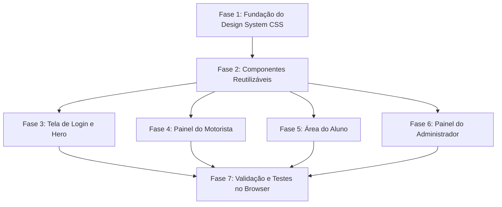

# Plano de Implementação — Redesign e Modernização Visual do UniDrive

Este documento detalha o plano estratégico de implementação para renovar completamente a interface e a experiência de usuário (UI/UX) do **UniDrive**, em conformidade com as diretrizes do projeto e os mockups fornecidos em `frontend/public/mockups`.

---

## 1. Diagnóstico e Análise dos Mockups

A análise visual dos mockups revelou uma identidade moderna, limpa e pensada especificamente para o uso sob luz do sol e em operação na van:

| Mockup | Tela Correspondente | Principais Elementos e Padrões Visuais |
| :--- | :--- | :--- |
| **`tela_login.jfif`** | Tela Inicial / Seleção de Perfil | Fundo com degradê azul suave (`#c8e4fc` a `#5ba7f3`), logotipo da van centralizado com capelo, título "UniDrive" em azul cobalto, subtítulo institucional e **card inferior branco arredondado** com botões táteis (Aluno preenchido, Motorista contornado, Admin minimalista). |
| **`tela1_motorista.jfif`** | Motorista — Aba "Hoje" | Fundo clean (off-white), cabeçalho minimalista com botão "Sair" em pílula cinza, **Gráfico Donut Circular SVG** destacando alunos pendentes, hora da última atualização com pulso verde "Ao vivo", **botão gigante azul "DECLARAR PARTIDA"** e ação secundária discreta em vermelho para cancelamento. |
| **`tela2_motorista.jfif`** | Motorista — Aba "Alunos" | Lista de cartões brancos com elevação suave (sem bordas pretas pesadas), **avatares circulares com foto ou inicial colorida**, nome com tipografia destacada, e **botão circular gigante de checkmark verde (🟢)** para registrar embarque com 1 toque. |
| **`tela3_motorista.jfif`** | Motorista — Aba "Avisos" | Card "Enviar Nova Mensagem" com caixa de texto arredondada, **chips de mensagens rápidas clicáveis** ("Vou atrasar 5 min", "Já estou no local", "Van no Bloco C", etc.) e botão largo "Enviar". |
| **`telas_admin.jfif`** | Painel do Administrador | Três visões padronizadas: <br>1. **Visão Geral**: Cards de métricas ("Motoristas Ativos", "Alunos Cadastrados", "Embarques Hoje") com mini-gráficos ilustrativos em linha/barra.<br>2. **Gestão de Motoristas**: Filtros em pílula ("Ativos" / "Desativados"), tabela clara com nome, contato, chave Pix, badge de status e **switch toggle liga/desliga**.<br>3. **Gestão de Alunos**: Tabela com avatar, contato, vínculo com motorista ("🚐 Rovilson"), status e ações rápidas. |

---

## 2. Design System: Tokens e Especificações

O novo sistema substituirá o tema escuro atual por um **Light Mode de Alto Contraste**, otimizado para celulares acoplados ao painel do veículo:

### Paleta de Cores
```css
:root {
  /* Superfícies & Fundos */
  --bg-page: #f4f7fb;            /* Fundo geral gelo/off-white anti-reflexo */
  --bg-card: #ffffff;            /* Fundo de cards brancos */
  --bg-input: #f8fafc;           /* Fundo sutil de inputs */
  --border-subtle: #e2e8f0;      /* Linhas divisórias suaves */
  --border-card: rgba(226, 232, 240, 0.8);

  /* Cores Principais da Marca */
  --primary: #0b63ce;            /* Azul UniDrive vibrante */
  --primary-hover: #0952af;      /* Azul escuro no hover/ativo */
  --primary-light: #e8f2fe;      /* Azul claro para tags e chips */
  --primary-gradient: linear-gradient(180deg, #d3eaff 0%, #8dc5f8 50%, #5ba7f3 100%);

  /* Cores Semânticas de Ação */
  --success: #22c55e;            /* Verde check de embarque / ativo */
  --success-light: #dcfce7;
  --danger: #ef4444;             /* Vermelho suave para cancelamentos e desativações */
  --danger-light: #fee2e2;
  --accent-gold: #f59e0b;        /* Dourado para avisos / pagamentos */

  /* Tipografia & Contraste */
  --text-main: #0f172a;          /* Azul ardósia profundo para leitura instantânea */
  --text-muted: #64748b;         /* Cinza médio para legendas e horários */
  --text-light: #94a3b8;

  /* Formas & Sombras */
  --radius-sm: 8px;
  --radius-md: 14px;
  --radius-lg: 20px;
  --radius-full: 9999px;
  --shadow-card: 0 4px 20px rgba(15, 23, 42, 0.05), 0 1px 3px rgba(15, 23, 42, 0.03);
  --shadow-elevated: 0 10px 30px rgba(11, 99, 206, 0.08);
}
```

---

## 3. Etapas de Execução do Redesign



### Fase 1: Fundação do Design System & Folhas de Estilo Globais
1. **`frontend/src/styles/index.css`**:
   - Transição do fundo escuro atual para o fundo claro (`--bg-page`).
   - Importação da fonte `Inter` com pesos `400, 500, 600, 700, 800`.
   - Remoção de estilos dark-mode hardcoded e resets globais.
2. **`frontend/src/styles/components.css`**:
   - **Botões**: Altura mínima de 48px a 54px para toque fácil em movimento, variantes `primary` (azul sólido), `secondary` (contorno azul ou fundo claro), `ghost` e `danger`.
   - **Cards**: Fundo branco, cantos arredondados (`border-radius: 16px`), sombra sutil (`--shadow-card`).
   - **Badges**: Pílulas estilizadas com fundo translúcido e texto contrastante (ex.: `Ativo`, `Pendente`, `Embarcado`).
   - **Inputs & Textareas**: Bordas suaves, background `#f8fafc`, foco em azul UniDrive.
   - **Switches & Toggles**: Estilo iOS/moderno para alternar status ativo/inativo instantaneamente.
3. **`frontend/src/styles/layout.css`**:
   - Header do app com logo alinhada e botão de logout em pílula cinza clara.
   - BottomNavigation com fundo branco, borda superior sutil, ícones limpos e destaque do item ativo em azul.

---

### Fase 2: Novos Componentes Especializados
1. **`DonutProgressChart.tsx`**:
   - Gráfico de progresso circular interativo em SVG puro (sem bibliotecas pesadas).
   - Mostra o anel de progresso azul, o número de alunos pendentes com fonte grande e legível, e o indicador pulsante "Ao vivo".
2. **`QuickMessageChips.tsx`**:
   - Conjunto de tags clicáveis com mensagens frequentes do motorista (`"Vou atrasar 5 min"`, `"Já estou no local"`, `"Van no Bloco C"`, etc.).
   - Ao clicar, insere ou concatena diretamente no campo de texto de avisos.
3. **`Avatar.tsx`**:
   - Renderiza avatar circular elegante com a inicial do usuário em cores harmônicas (ex.: roxo, verde, terracota) ou imagem de perfil se disponível.
4. **`ToggleSwitch.tsx`**:
   - Componente de switch liga/desliga para status ativo/desativado nas telas de gerenciamento.

---

### Fase 3: Redesign da Tela de Login (`login.tsx` e `loginForms.tsx`)
- Alinhar com o mockup `tela_login.jfif`:
  - Contêiner de tela cheia com degradê azul suave de fundo.
  - Logo e ícone UniDrive centralizados com sombra sutil.
  - Card branco inferior elevado com bordas arredondadas no topo (`24px`).
  - Botão 1: "🎓 Entrar como Aluno" (azul sólido).
  - Botão 2: "🚐 Entrar como Motorista" (fundo branco, contorno azul).
  - Botão 3: "⚙️ Acesso Administrativo" (texto cinza neutro com ícone).
  - Formulário de login interno (`loginForms.tsx`) com a mesma linguagem visual limpa e botão voltar intuitivo.

---

### Fase 4: Redesign do Painel do Motorista (`DriverHome.tsx` e `DriverStudentList.tsx`)
- **Aba "Hoje" (`tela1_motorista.jfif`)**:
  - Incorporar o `DonutProgressChart`.
  - Botão principal: **"DECLARAR PARTIDA"** (azul vibrante, fonte em caixa alta, largura total).
  - Ação secundária: Link/botão de texto vermelho suave `"Cancelar Viagem de Hoje"` com diálogo de confirmação.
- **Aba "Alunos" (`tela2_motorista.jfif`)**:
  - Limpar as informações desnecessárias durante o embarque (diminuir peso do e-mail).
  - Adicionar o `Avatar` com a inicial de cada aluno.
  - Implementar o **botão circular verde de confirmação 🟢 ("Embarcado" / "Concluído")**, tornando o check-in um toque instantâneo.
- **Aba "Avisos" (`tela3_motorista.jfif`)**:
  - Card "Enviar Nova Mensagem" estilizado como mensageiro moderno.
  - Inclusão dos `QuickMessageChips` para o motorista disparar avisos sem precisar digitar no volante.

---

### Fase 5: Alinhamento da Área do Aluno (`StudentHome.tsx`, `DailyStatusCard.tsx`, `StudentPaymentsCard.tsx`)
- Estender a mesma linguagem visual de alta legibilidade para os passageiros:
  - Mini card de progresso da van e status ao vivo.
  - Seleção do status diário (`Vou normal`, `Só ida`, `Só volta`, `Não vou`) em 4 cartões com ícones táteis e indicação clara de seleção.
  - Botão de auto check-in grande e visível para o aluno confirmar seu embarque.
  - Tela de Pagamento com cópia da chave Pix em um clique e badge de confirmação de mensalidade.

---

### Fase 6: Redesign do Painel Administrativo (`AdminHome.tsx` e Gerenciamentos)
- Alinhar com o mockup `telas_admin.jfif`:
  - Barra de abas horizontais com pílulas indicadoras ("Visão Geral", "Motoristas", "Alunos", "Admins").
  - **Visão Geral**: Grid com os 3 cards de métricas ilustradas (Motoristas Ativos, Alunos Cadastrados, Embarques Hoje com mini gráficos SVG).
  - **Gestão de Motoristas & Alunos**:
    - Abas em pílula: `[ Ativos (verde) ]` e `[ Desativados (vermelho) ]`.
    - Tabela moderna com colunas alinhadas: Avatar com inicial, Nome, Contato, Chave Pix/Vínculo da van, Badge de status e coluna de Ações com ícone de visualização 👁️ e `ToggleSwitch`.
    - Botão no topo `+ Novo Motorista` / `+ Novo Aluno`.

---

## 4. Matriz de Componentes e Arquivos Afetados

| Arquivo | Mudanças Planejadas |
| :--- | :--- |
| `frontend/src/styles/index.css` | Substituição do tema escuro por tokens light mode, tipografia Inter, novos gradientes e resets. |
| `frontend/src/styles/components.css` | Botões táteis largos, cards brancos elevados, inputs, badges pílula, switches e modais claros. |
| `frontend/src/styles/layout.css` | Header da marca, BottomNavigation com abas azuis ativas, grids de métricas e tabelas. |
| `frontend/src/components/DonutProgressChart.tsx` | **(Novo)** Gráfico circular SVG de progresso do embarque. |
| `frontend/src/components/QuickMessageChips.tsx` | **(Novo)** Chips de mensagens instantâneas para avisos. |
| `frontend/src/components/Avatar.tsx` | **(Novo)** Avatar com fotos ou iniciais elegantes. |
| `frontend/src/components/ToggleSwitch.tsx` | **(Novo)** Controle deslizante para ativação rápida no admin. |
| `frontend/src/pages/login.tsx` | Fundo em degradê azul e card inferior arredondado de acordo com `tela_login.jfif`. |
| `frontend/src/components/loginForms.tsx` | Formulário limpo com estética integrada ao card de login. |
| `frontend/src/pages/DriverHome.tsx` | Tela "Hoje" com Donut Chart, "DECLARAR PARTIDA" e tags rápidas na aba Avisos. |
| `frontend/src/features/driver/DriverStudentList.tsx` | Cards de alunos com avatares e checkmark verde circular gigante. |
| `frontend/src/features/dailyStatus/DailyStatusCard.tsx` | Layout de botões de presença tátil e contador visual para o aluno. |
| `frontend/src/pages/AdminHome.tsx` | Grid de métricas da visão geral com ilustrações de mini-gráficos. |
| `frontend/src/features/admin/DriverManagement.tsx` | Tabela padronizada com pílulas de filtro e switch de status. |
| `frontend/src/features/admin/StudentManagement.tsx` | Tabela padronizada com vínculo do motorista e visualização moderna. |

---

## 5. Critérios de Sucesso e Validação

1. **Fidelidade aos Mockups**: As telas do motorista, login e admin refletirão fielmente a paleta, proporções e componentes vistos em `frontend/public/mockups`.
2. **Usabilidade sob Luz Solar (Ergonomia)**: Fundo claro com contraste superior (WCAG AA), fontes grandes e botões com alvos táteis mínimos de 48px.
3. **Consistência Total**: A mesma identidade visual se estenderá para a área do aluno e fluxos administrativos, criando uma experiência coesa e profissional.
4. **Sem Dependências Pesadas**: Utilização de CSS Vanilla puro e SVG sem adicionar frameworks externos desnecessários, mantendo a simplicidade do projeto.
5. **Zero Quebra de Lógica**: Todas as integrações com backend (REST polling, push notifications, baixa de pagamentos e check-ins) permanecerão 100% funcionais.
